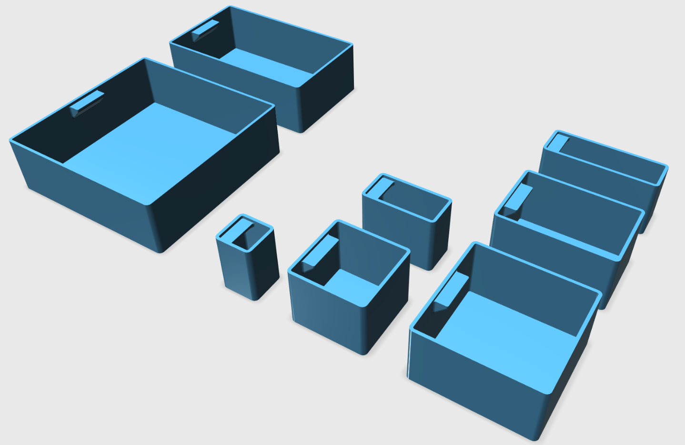
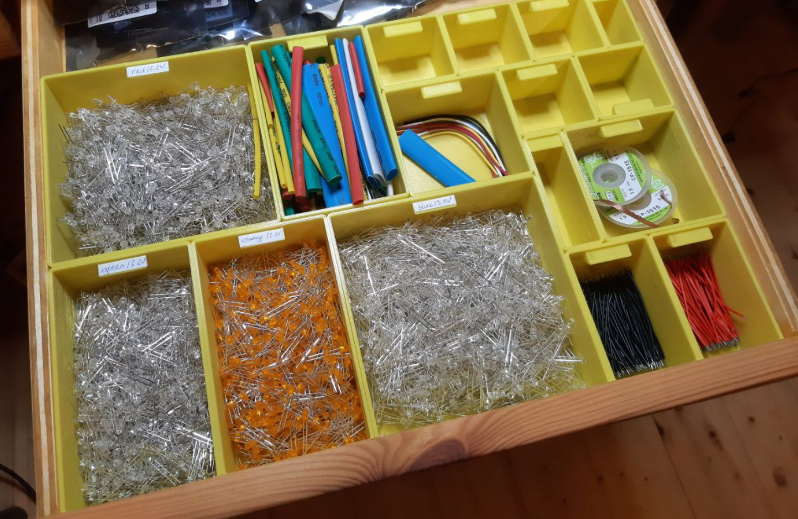

# Modular Printable Boxes

They are designed as a selection of 3D printable boxes that can be used to store small items. While there are already many similar solutions availabe online, none of these fitted the dimensions of my drawer. Therefore I designed my own boxex, all on a 25 mm base. This common base makes it possible to combine the boxes in almost every way.

_(3D models of the boxes)_

As can be seen in this image of the 3D program, I designed quite a few different sizes. All of them come with a label area to mark the boxes.

_(Printed boxes in use)_

The drawer with the boxes. The small area for the label is very hepful to note things such as LED colors.
